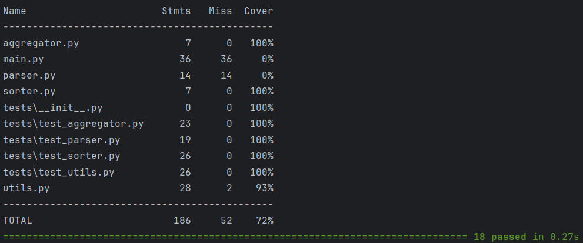
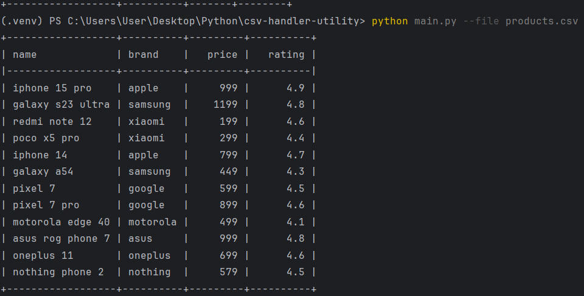
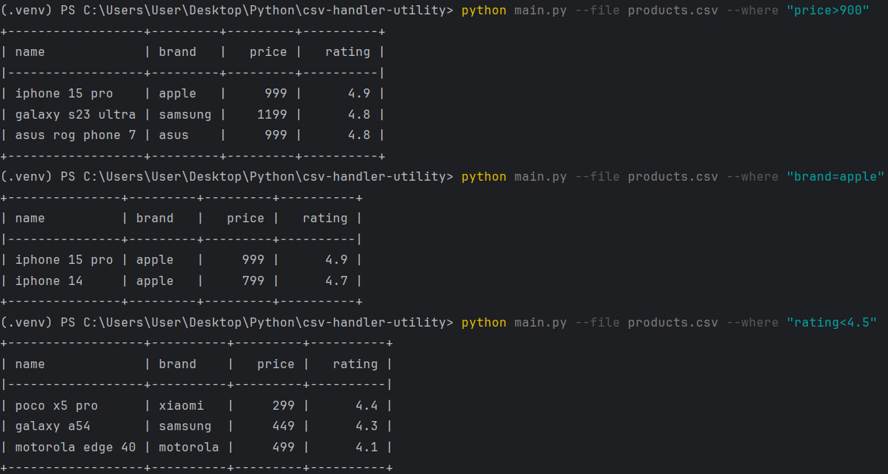
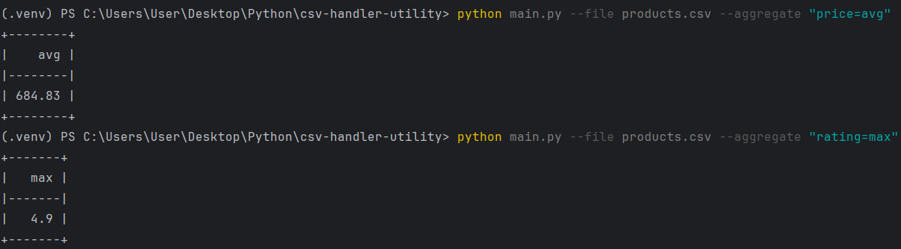
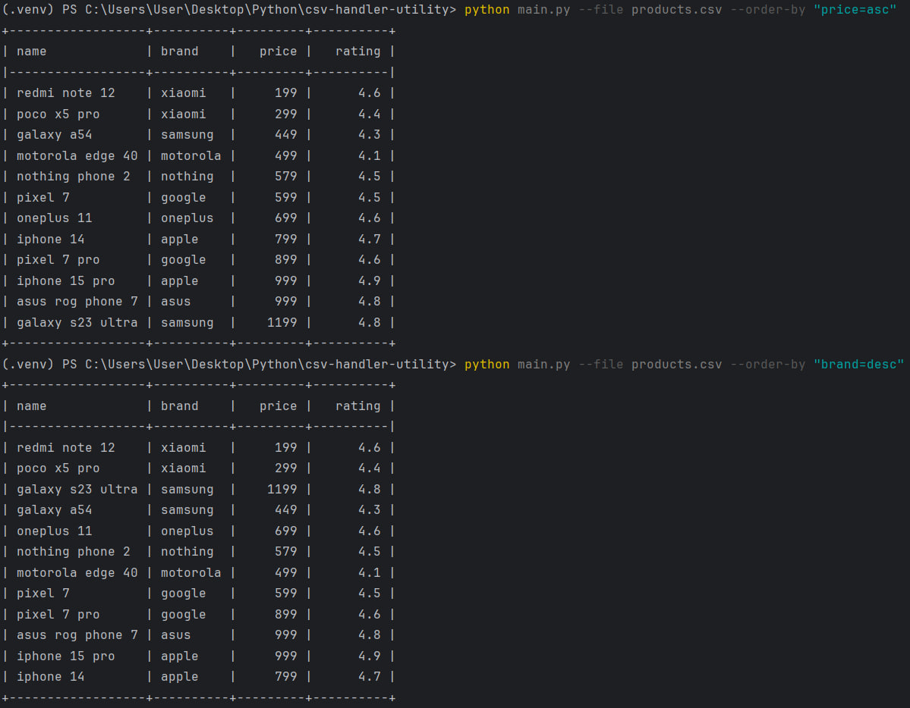
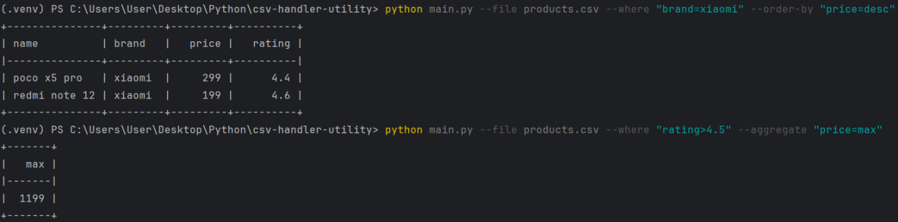
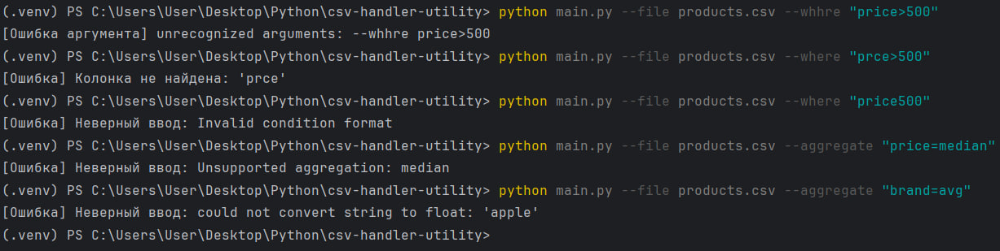

# csv-handler-utility

Утилита для работы с CSV-файлами через командную строку


# Возможности

### 📂 Указание файла через путь
### 🔍 Фильтрация данных по условию (`--where`)
### 📊 Аггрегация значений в колонке (`--aggregate`)
### 🔃 Сортировка данных по колонке (`--order-by`)
### ⚠️ Обработка ошибок с понятными сообщениями


# Технологии
### 🐍 Python 3.12
### 📦 pytest — тестирование
### 📊 tabulate — красивый табличный вывод
### 📝 argparse — парсинг аргументов командной строки
### 🔧 csv — для работы с CSV файлами
### 💻 typing — аннотации

---

# Тесты

Используются автоматизированные тесты с помощью pytest для проверки корректности работы основных функций, включая
фильтрацию данных, агрегацию и сортировку, а также парсинг условия и аргументов из командной строки. Процент покрытия: 72%.

```
pytest --cov=. --cov-report=term
```

 
---
# Примеры запуска:

### 🖥️ Вывод содержимого


### 🔍 Фильтрация


### 📊 Агрегация


### 🔃 Сортировка:


### 🔀 Комбинированные:


### ⚠️ Вывод ошибок
